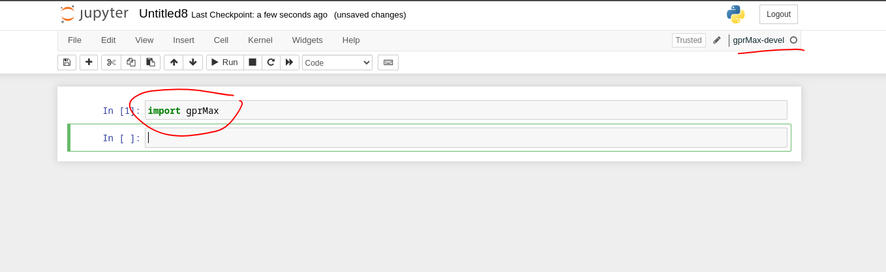

<p align="center">
  
</p>

## 💻 **Google Summer of Code 2023**:


* **Project Name:** Create a gprMax Custom Kernel for Jupyter Notebook

* **Mentors:**
  - Rania Patsia
  - John Hartley

## ✍🏼 **PROJECT DESCRIPTION**:

We create a custom gprMax kernel in the Jupyter Notebook which contains all the necessary modules and files from the gprMax installation that can be used within the Jupyter Notebook.

## 📂 **FILES**:

1. `install_notebook_dependencies.py` - Used for installing the gprMax-devel kernel on Jupyter Notebook.
2. `3D_visualization_toolbox` - Contains a custom 3D visualization function using the PyVista python library to show the geometry output of the model.
3. Modified gprMax files - Adjusted relative imports in these files from the gprMax-devel branch to resolve errors.
4. Test Models Notebooks - Files like `cylinder_Ascan_2D` and others, each containing a test notebook showcasing gprMax usage in notebooks.
5. `colab_notebook.ipynb` - This file contains instructions of how to install gprMax on a Google Colab notebook, run the model and also visualize the `.vti` 3D output. An example is also given within it with the `cylinder_Ascam_2D` file. 

Each folder has its own README which gives a short description of its contents.

## 🚀 **INSTALLATION INSTRUCTIONS**:

1. Install the gprMax-devel as you would for a normal installation, ensuring that [Miniconda](https://docs.conda.io/en/latest/miniconda.html) and GCC (for Linux/Mac) or [Microsoft Build Tools for Visual Studio 2022](https://aka.ms/vs/17/release/vs_BuildTools.exe) (for Windows) are installed.

```shell
$ conda update conda
$ conda install git
$ git clone --branch devel https://github.com/gprMax/gprMax.git
$ cd gprMax
$ conda env create -f conda_env.yml
$ conda activate gprMax-devel
$ cd ..
$ pip install -e gprMax
```
2. We run the install_notebook_dependencies.py file from the terminal which installs the gprMax-devel kernel in the Jupyter Notebook

```shell
$ python install_notebook_dependencies.py
```
## 📔 **NOTEBOOK ENVIRONMENT**:

After completing the installation, you can launch your Jupyter Notebook and create a new notebook. From the kernel options, select the gprMax-devel custom kernel that you've installed. This will allow you to use the gprMax functionality seamlessly within your Jupyter Notebook environment.

<p align="center">
  
</p>

## 📄 **UPDATED gprMax FILES**:

During the installation of gprMax on a system running Fedora 38, the evtk imports were producing errors. So I edited a few lines of the code that handles the import inheritance of the evtk module. 

## 🔗 **ISSUED PULL REQUEST**:

A pull request has been issued to add my work done of some changes and updates and new feature to the original gprMax repo.
The pull request can be found below:

[PULL REQUEST](https://github.com/gprMax/gprMax/pull/376)


## 🎉 **FINAL NOTE**:

Feel free to explore and experiment with the gprMax custom kernel in your Jupyter Notebook environment. If you encounter any issues or have questions, don't hesitate to reach out for assistance.

Happy coding!

---

I also made a very concise Notion page where I wrote little parts of what I did, just like that. It's not at all comprehensive, it's just for fun.


[Notion Page](https://www.notion.so/srutanik/Google-Summer-of-Code-23-gprMax-1b9f5600fe554cf8a3fca4c775b6e485?pvs=4)

